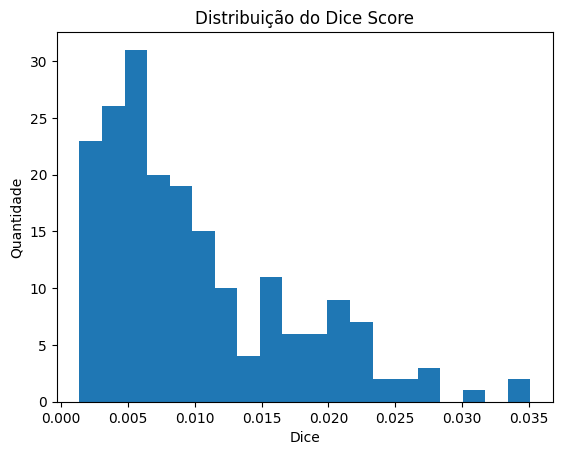

# 🧠 Segmentação de Lesões Cerebrais em MRI com UNet

Este projeto implementa uma **rede neural UNet** em PyTorch para segmentação de imagens de ressonância magnética (MRI) do cérebro, permitindo identificar regiões de interesse de forma automática.

---

## 🔹 Objetivo

O projeto ainda está em desenvolvimento e será utilizado em uma API para segmentação de imagens de ressonância magnética,  
com o objetivo de colaborar na **detecção precoce de sinais de Esclerose Múltipla**.

---

## 🔹 Resultado dos treinamentos

- Após a atualização e a implementação de novos scripts para o treinamento automático e aprimorado, no momento obtêm-se os seguintes resultados:

---

## ⚠️ Status Atual

- O projeto ainda está em fase de **treinamento e testes**.
- Este README será atualizado à medida que o treinamento avance e os resultados melhorem.

## Alguns resultados por enquanto - MUITO BAIXOS, SEM RESULTADO APARENTES

