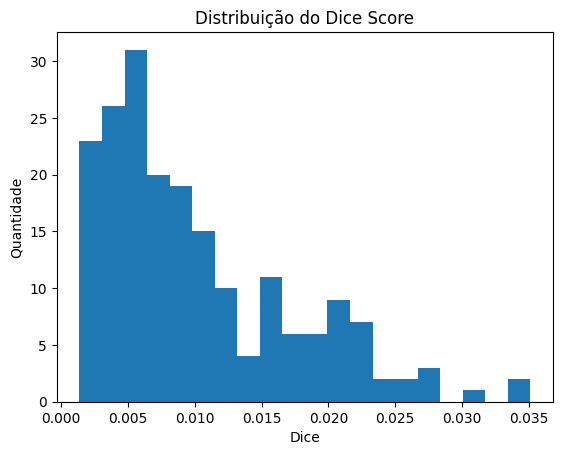

# 🧠 Segmentação de Lesões Cerebrais em MRI com UNet

Este projeto implementa uma **rede neural UNet** em PyTorch para segmentação de imagens de ressonância magnética (MRI) do cérebro, permitindo identificar regiões de interesse de forma automática.

---

## 🔹 Objetivo

O projeto ainda está em desenvolvimento e será utilizado em uma API para segmentação de imagens de ressonância magnética,  
com o objetivo de colaborar na **detecção precoce de sinais de Esclerose Múltipla**.

---

## 🔹 Resultado dos treinamentos

- Após a atualização e a implementação de novos scripts para o treinamento automático e aprimorado, no momento obtêm-se os seguintes resultados:


---

## ⚠️ Status Atual

- O projeto ainda está em fase de **treinamento e testes**.
- Este README será atualizado à medida que o treinamento avance e os resultados melhorem.

## Alguns resultados por enquanto - MUITO BAIXOS, SEM RESULTADO APARENTES




---

## 📖 Entendendo o Projeto (Para Iniciantes)

O projeto é dividido em 3 fases principais: Preparação, Treinamento e Uso (API).

### 1. Preparação (Tratando as imagens)
Arquivos médicos originais são 3D e muito pesados. Precisamos transformá-los em imagens 2D simples (como fotos normais) para a Inteligência Artificial (IA) conseguir estudar.
* **`converter_dataset.py`**: Pega os exames originais da pasta `dataset_original` e corta em várias imagens menores (.png), separando a imagem do cérebro e a "máscara" (que mostra onde está a lesão).

### 2. A Sala de Aula (Treinando a IA)
É aqui que a IA olha para as imagens milhares de vezes para aprender a reconhecer as lesões.
* **`model.py`**: É o "esqueleto" do cérebro da IA (a rede neural).
* **`train_unet_pro.py`**: O arquivo principal! Ele pega o esqueleto (`model.py`), mostra as imagens para a IA e a ensina. No final, salva o que ela aprendeu em um arquivo chamado `unet_mri_model.pth`.
* **`treinamento_unet.ipynb`**: Faz a mesma coisa que o arquivo acima, mas em formato de caderno interativo com textos explicativos.
* **`learning.py`**: Um arquivo simples que gera um gráfico para mostrar se a IA está aprendendo bem ou não.

### 3. Colocando a IA para Trabalhar (A API)
Depois que a IA aprendeu, criamos um "servidor" para receber imagens novas e mostrar o resultado.
* **`api.py`**: É o servidor. Fica ligado esperando você mandar uma imagem. Quando recebe, pede para a IA olhar e devolve a imagem com a lesão pintada de vermelho.
* **`inference.py`**: É o assistente da API. Pega a imagem nova e usa o cérebro salvo da IA (`unet_mri_model.pth`) para achar a lesão.
* **`test_interface.py`**: É uma telinha simples (interface) para você testar. Você escolhe uma imagem do seu computador, ele envia para a API e abre o resultado na sua tela.

---

## 🚀 Como Executar o Projeto

Antes de tudo, garanta que o seu ambiente virtual está ativado. O seu terminal deve começar com `(.venv)`.
Se não estiver, ative com o comando (no Windows):
```powershell
.venv\Scripts\Activate.ps1
```

### Se você quer TREINAR a IA para deixá-la mais inteligente:
Basta rodar o arquivo de treinamento. Ele vai usar as imagens da pasta `dataset` e, quando terminar, salvar o arquivo `unet_mri_model.pth`.
```powershell
python train_unet_pro.py
```
*(Você pode usar `python train_unet_pro.py --epochs 10` para treinar por mais tempo, substituindo o 10 pelo número de épocas desejado).*

### Se você quer TESTAR a IA com imagens novas:
**Passo 1:** Primeiro, precisamos ligar o servidor da API. Abra o terminal e digite:
```powershell
python -m uvicorn api:app --reload
```
O servidor ficará rodando. **Não feche este terminal!**

**Passo 2:** Abra um **novo terminal** (lembre-se de ativar o ambiente virtual nele também) e rode a interface de teste:
```powershell
python test_interface.py
```
Uma janela vai abrir para você selecionar uma imagem. Escolha uma foto do cérebro (por exemplo, na pasta `dataset/images`). O programa vai analisar, mostrar um relatório na tela e abrir as imagens com a lesão pintada de vermelho (salvas no seu computador como `resultado_overlay.png` e `resultado_heatmap.png`).
